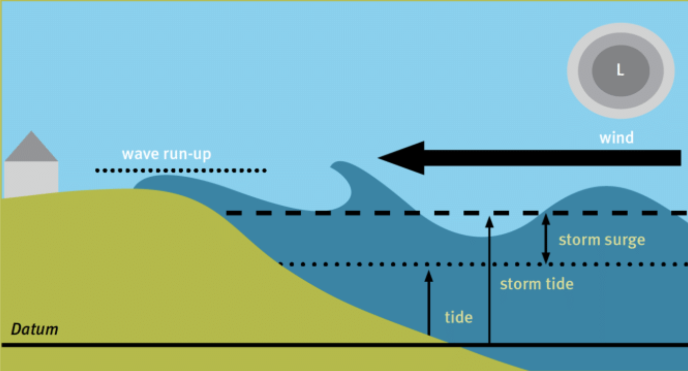

+++
title = "Introduction"
date =  2020-06-13T05:13:08+08:00
weight = 0
+++

# AWS Baseline

This site's content is designed to be consumed by large number of AWS customers in a self-service manner in order to have their AWS workload fulfill the core best practices that are common to a wide variety of workloads.

The content is served as guidelines and not an assurance. Baseline, given the definition below, may vary depending on state of the workload. While the content in this site attempts to cover the most common best practices, do engage your account team for further advices for your specific workload.

## Definition

**baseline** *noun*

/ˈbeɪslaɪn/

[usually singular]

*(technology)* a line or measurement that is used as a starting point when comparing facts.

(credit: researchgate.net)
