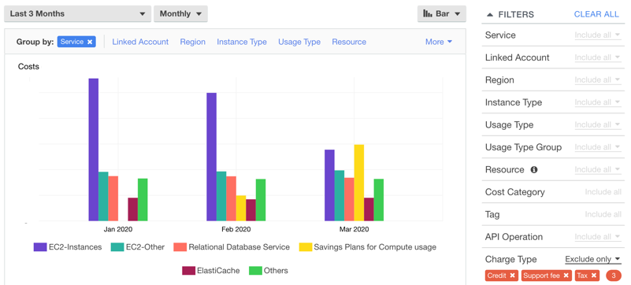
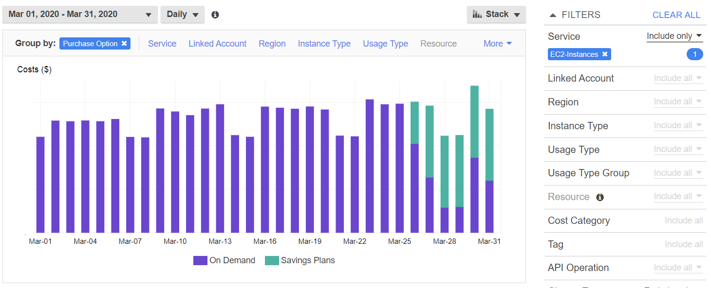
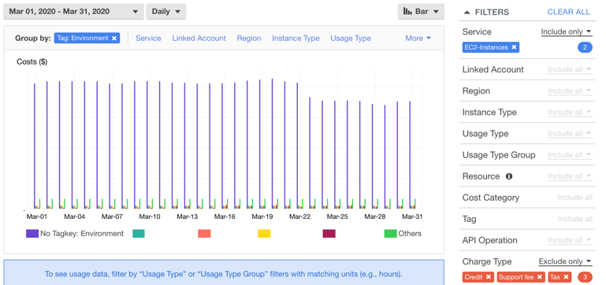
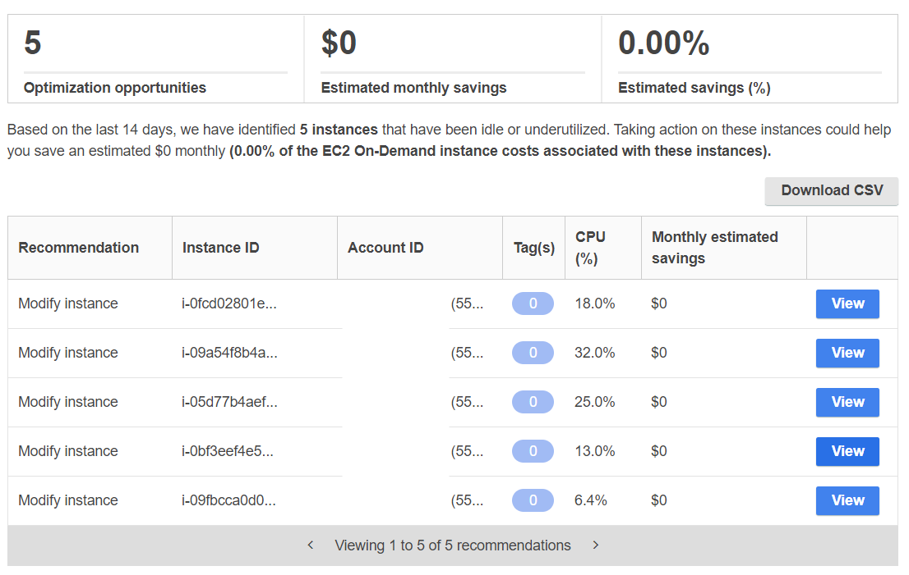
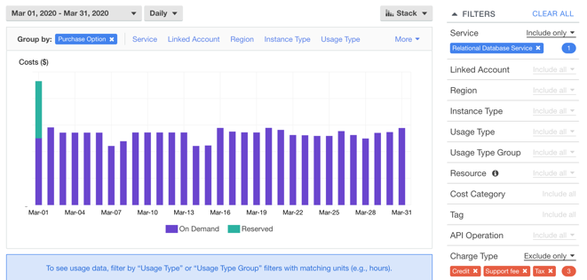
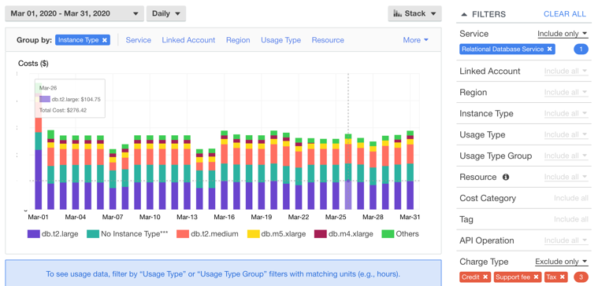
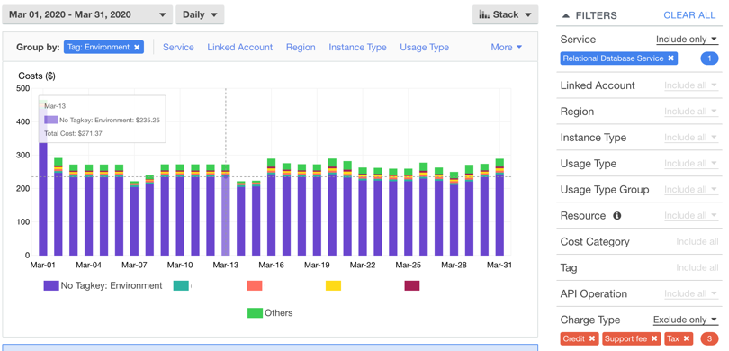
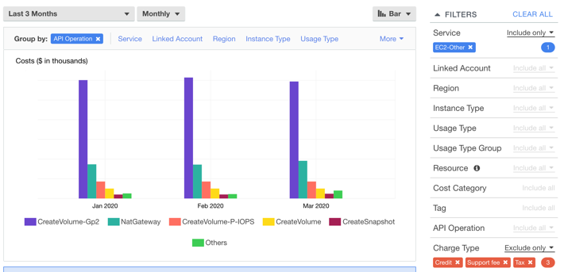
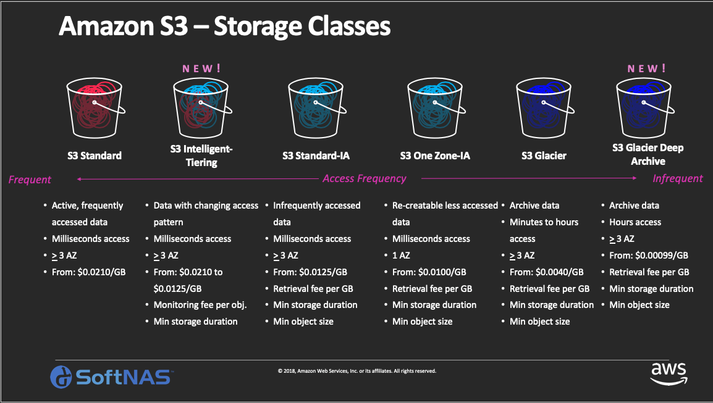

+++
title = "Reduce your top AWS costs"
date =  2020-06-13T05:37:54+08:00
weight = 1
+++

This section presents a process in analyzing and optimizing your AWS costs. This guide walks you through steps to review your AWS bill, understand the top services that have highest costs, and identify immediate actions to reduce those costs.

### What are expected outcomes?

1. Immediate actions that can reduce your AWS costs.
2. Understand the process and able to repeat the process frequently.

### Pre-requisites

1. Have access to Billing console [[link](https://docs.aws.amazon.com/awsaccountbilling/latest/aboutv2/control-access-billing.html)].
2. Enable Rightsizing Recommendations on Cost Explorer console [[link](https://docs.aws.amazon.com/awsaccountbilling/latest/aboutv2/ce-rightsizing.html)].
3. Understand key concepts
   * Cost Explorer [[link](https://aws.amazon.com/aws-cost-management/aws-cost-explorer/)].
   * Amazon EC2 pricing models [[link](https://aws.amazon.com/ec2/pricing/)].

### Step-by-Step Guide

Please note this section covers Cost Explore analysis. If you have Trusted Advisor via business/enterprise support, you can find immediate cost saving such as “Unattached load balancers”, “Unattached EBS” or “Unassociated EIP”.

#### Access Cost Explorer

1. Select Services > AWS Cost Explorer > Select “Explore costs”

#### Identify top 5 cost components

1. Filters > Charge Type: “Exclude only“, select ”Refund“, ”Credit'“, ”Support fee“, ”Tax“ (if available). Keep these filters for the entire session.
1. Group by: “Service”
1. Date range: Last 3 months (and optionally current month), frequency as “Monthly”
1. Select graph type: “Bar”

Follow below sections for each component contributed the most to your costs

#### Identify and remove unused services

For examples, in the above image, if ElastiCache is identified to be no longer in use, the resource on ElastiCache should be removed.

From this step onwards, let's change the frequency from “Monthly” to “Daily”

#### EC2

1. Service: “EC2-Instances” (Note: ECS and EKS are not within this scope)
1. Group by: More > “Purchase Option”. The graph provides information on potential gaps for additional Reserved Instances or Savings Plan instead of On Demand.
   * Use Amazon [EC2 Spot Instances](https://aws.amazon.com/ec2/spot/?track=costop) to reduce EC2 costs [1].
   * Use Compute [Savings Plans](https://aws.amazon.com/savingsplans/?track=costop) to reduce EC2, Fargate and Lambda costs [2].

1. Observe whether the resources are dynamically scaled up and down or remain flat.
   * Use Auto Scaling Group (ASG) to dynamically adjust the resources according to your business need. Especially for non-production environments, ASG should be configured to scale down even to 0.
   * Identify instances with low-utilization and reduce cost by stopping or rightsizing [3].
1. Change Group by option to “Instance Type”, observe if there is T, AMD or ARM instance types are used. For suitable workloads, [ARM](https://aws.amazon.com/ec2/instance-types/a1/) instance type provides cost saving up to 30% compared to other types.
1. Change Group by option to “Tag: Environment”, given proper tagging, observe if non-production environment’s resources are scaled up and down, especially during the weekend. In addition, if your development environment does not have strict requirement on latency, you have option to run this development environment on other regions, such as US regions, which have lower cost for the same instance types in other regions such as Singapore.

1. Click on the “Recommendations” link on the left menu to view “Resource optimization recommendations”, select “View all”        

#### RDS

1. Service: “Relational Database Service” (search for RDS).
1. Group by: More > “Purchase Option”. The graph provides information on potential gaps for additional Reserved Instances instead of On Demand. Use Reserved Instances (RI) to reduce RDS, Redshift, ElastiCache and Elasticsearch costs [4].

1. Observe whether the resources are dynamically scaled up and down or remain constant. Similar to EC2, you can schedule to turn off and on RDS resources as needed. In addition, [Amazon Aurora Serverless](https://aws.amazon.com/rds/aurora/serverless/) provides the ability to autoscale your database, even to 0.
1. Group by: “Instance type”. Observe if there is T, AMD or ARM instance types are used. For suitable workloads, [ARM](https://aws.amazon.com/ec2/instance-types/a1/) instance type provides cost saving up to 30% compared to other types. Change T instance type to M, or R for production workload.

1. Change Group by option to “Tag: Environment”, given proper tagging, observe if non-production environment’s resources are scaled up and down, especially during the weekend. Identify instances with low-utilization and reduce cost by stopping or rightsizing [3].

#### EC2 Other

1. Service: “EC2-Other”, group by “API operation” to see which services are the biggest contributors.

1. Optimization options are:
    * If “CreateSnapshot” is significant (e.g. > half of GP2 spend indicated by “CreateVolume-Gp2”), review the snapshot policy for how long snapshots are being retained, and how frequently snapshots are occurring.
    * Identify Amazon EBS volumes with low-utilization and reduce cost by snapshotting, downsizing the volume, or even deleting them if they are no longer in use. [5]

#### ElasticCache

1. Use Reserved Instances (RI) to reduce RDS, Redshift, ElastiCache and Elasticsearch costs [4]

#### S3

1. Analyze Amazon S3 usage and reduce cost by leveraging lower cost storage tiers. Use [S3 Analytics](https://docs.aws.amazon.com/AmazonS3/latest/dev/analytics-storage-class.html) to analyze storage access patterns on the object data set for 30 days or longer. [6]

#### Other opportunities: DynamoDB, EMR, Redshift

1. DynamoDB
    * Analyze Amazon DynamoDB usage and reduce cost by leveraging Autoscaling or On-demand [7] instead of fixed provisioned capacity.
1. EMR
    * Use Amazon [EC2 Spot Instances](https://aws.amazon.com/ec2/spot/?track=costop) to reduce EC2 costs [1].
1. Redshift
    * Redshift recently announced redshift [pause and resume](https://aws.amazon.com/about-aws/whats-new/2020/03/amazon-redshift-launches-pause-resume/) allowing saving cost when they are not in use.

### References

[1] Use Amazon [EC2 Spot Instances](https://aws.amazon.com/ec2/spot/?track=costop) to reduce EC2 costs: Customers can use Spot Instances to receive up to a 90% discount off On-Demand prices without making a term-based commitment. Spot instances are an ideal option for applications that are fault-tolerant, scalable, or flexible, such as big data (EMR, Hadoop, Spark clusters), containerized workloads (ECS/EKS or self-managed Kubernetes), CI/CD, web servers, high performance computing (Batch, grid servers, genomic sequencing) and test & development environments.

[2] Use Compute Savings Plans (<https://aws.amazon.com/savingsplans/?track=costop)> to reduce EC2, Fargate and Lambda costs: Savings Plans is a flexible pricing model that provides savings of up to 72% on your AWS compute usage. This pricing model offers lower prices on Amazon EC2 instances usage, regardless of instance family, size, OS, tenancy or AWS Region, and also applies to AWS Fargate and AWS Lambda usage. Use the recommendations provided in AWS Cost Explorer, and ensure that you have chosen compute, one year, no upfront options. Once you sign up for Savings Plans, your compute usage is automatically charged at the discounted Savings Plans prices.

[3] Identify resources with low-utilization and reduce cost by stopping or rightsizing:

* Use AWS Cost Explorer Resource Optimization (<https://docs.aws.amazon.com/awsaccountbilling/latest/aboutv2/ce-rightsizing.html)> to get a report of EC2 instances that are either idle or have low utilization. You can reduce costs by either stopping or downsizing these instances.
* Use AWS Instance Scheduler (<https://aws.amazon.com/solutions/implementations/instance-scheduler/?track=costop)> to automatically stop EC2 or RDS instances.
* Use AWS Operations Conductor (<https://aws.amazon.com/solutions/implementations/operations-conductor/?track=costop)> to automatically resize the EC2 instances (based on the recommendations report from Cost Explorer).

[4] Use Reserved Instances (RI) to reduce RDS, Redshift, ElastiCache and Elasticsearch costs: For certain services like Amazon RDS, you can invest in reserved capacity. With Reserved Instances (<https://aws.amazon.com/aws-cost-management/aws-cost-optimization/reserved-instances/?track=costop),> you can save up to 72% over equivalent on-demand capacity. Reserved Instances are available in 3 options – All up-front (AURI), partial up-front (PURI) or no upfront payments (NURI). Use the recommendations provided in AWS Cost Explorer RI purchase recommendations, which is based on your RDS, Redshift, ElastiCache and Elasticsearch usage.

[5] Identify Amazon EBS volumes with low-utilization and reduce cost by snapshotting then deleting them. EBS volumes that have very low activity (less than 1 IOPS per day) over a period of 7 days indicate that they are probably not in use. Identify these volumes using the Trusted Advisor Underutilized Amazon EBS Volumes Check (<https://aws.amazon.com/premiumsupport/technology/trusted-advisor/best-practice-checklist/?track=costop).> To reduce costs, first snapshot the volume (in case you need it later), then delete these volumes. You can automate the creation of snapshots using the Amazon Data Lifecycle Manager (<https://docs.aws.amazon.com/dlm/index.html).> Follow the steps here (<https://docs.aws.amazon.com/AWSEC2/latest/UserGuide/ebs-deleting-volume.html)> to delete EBS volumes.

[6] Use S3 Analytics (<https://docs.aws.amazon.com/AmazonS3/latest/dev/analytics-storage-class.html)> to analyze storage access patterns on the object data set for 30 days or longer. It makes recommendations on where you can leverage S3 Infrequently Accessed (<https://aws.amazon.com/s3/storage-classes/#__?track=costop)> (S3 IA) to reduce costs. You can automate moving these objects into lower cost storage tier using Life Cycle Policies (<https://docs.aws.amazon.com/AmazonS3/latest/dev/object-lifecycle-mgmt.html).> Alternately, you can also use S3 Intelligent-Tiering (<https://aws.amazon.com/s3/storage-classes/#Unknown_or_changing_access/?track=costop),> which automatically analyzes and moves your objects to the appropriate storage tier.

[7] Analyze Amazon DynamoDB usage and reduce cost by leveraging Autoscaling or On-demand. Analyze your DynamoDB usage by monitoring 2 metrics, ConsumedReadCapacityUnits and ConsumedWriteCapacityUnits, in CloudWatch. To automatically scale (in and out) your DynamoDB table, use the AutoScaling feature. Using the steps here (<https://docs.aws.amazon.com/amazondynamodb/latest/developerguide/AutoScaling.Console.html#AutoScaling.Console.ExistingTable),> you can enable AutoScaling on your existing tables. Alternately, you can also use the on-demand option. This option allows you to pay-per-request for read and write requests so that you only pay for what you use, making it easy to balance costs and performance. HELLO WORLD

### Additional resources

1. Additional detailed labs for Cost Optimization [[link](https://wellarchitectedlabs.com/Cost/Fundamentals.html)]
