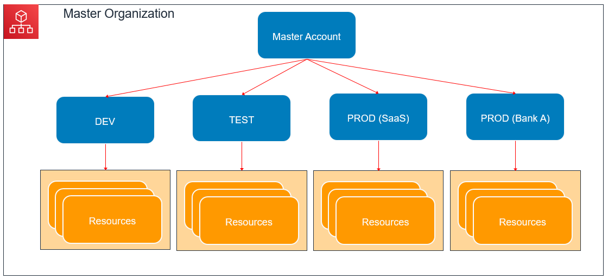
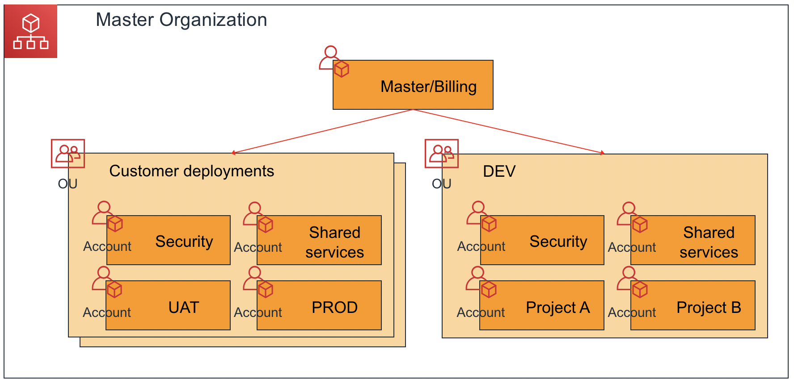

+++
title = "AWS Organizations"
date =  2020-06-13T05:13:08+08:00
weight = 1
+++

This section will give you an introduction to AWS Organizations and and a step-by-step guide to setting it up. You will also find hands-on labs that you can try at the end of the section before configuring your own system. Let’s begin!

### What are expected outcomes?

1. Understand the concept of AWS Organizations
2. Successfully set up an organization with multiple AWS accounts in AWS

### Pre-requisites

1. None

## What is AWS Organizations

AWS Organizations is an account management service that enables you to consolidate multiple AWS accounts into an organization that you create and centrally manage. AWS Organizations includes account management and consolidated billing capabilities that enable you to better meet the budgetary, security, and compliance needs of your business. As an administrator of an organization, you can create accounts in your organization and invite existing accounts to join the organization.

**Pricing**: AWS Organizations is offered at no additional charge. You are charged only for AWS resources that users and roles in your member accounts use.

You can find a comprehensive list of benefits though this documentation [here] (https://docs.aws.amazon.com/organizations/latest/userguide/orgs_introduction.html)

For common customer setup, the master account creates the organization and invites other existing accounts (member accounts such as DEV, TEST, PROD etc) to the organization. You can visualize this setup below:

If you are very new to AWS, I recommend reading this documentation to understand key terminologies [here](https://docs.aws.amazon.com/organizations/latest/userguide/orgs_getting-started_concepts.html).

## Setting up AWS Organization



In this [guide](https://aws.amazon.com/premiumsupport/knowledge-center/get-started-organizations/), you can create your organization and configure it with two AWS member accounts. You create one of the member accounts in your organization, and you invite the other account to join your organization. Next, you use the [allow list](https://docs.aws.amazon.com/organizations/latest/userguide/orgs_getting-started_concepts.html#allowlist) technique to specify that account administrators can delegate only explicitly listed services and actions. 

This allows administrators to validate any new service that AWS introduces before they permit its use by anyone else in your company. That way, if AWS introduces a new service, it remains prohibited until an administrator adds the service to the allow list in the appropriate policy. The tutorial also shows you how to use a [deny list](https://docs.aws.amazon.com/organizations/latest/userguide/orgs_getting-started_concepts.html#denylist) to ensure that no users in a member account can change the configuration for the auditing logs that AWS CloudTrail creates.

### Creating and configuring an organization

This [tutorial](https://docs.aws.amazon.com/organizations/latest/userguide/orgs_tutorials_basic.html) will help you create a master account, add member accounts and configure service control policies.

**Important Note**:
While creating new account, a valid email should be used (or an email which can be created later). This is to prepare for future operations such as removing/deleting accounts

### Monitoring changes to your organization with CloudWatch Events

As your organization grows, it is important to track changes that occur across your accounts. This [tutorial](https://docs.aws.amazon.com/organizations/latest/userguide/orgs_tutorials_cwe.html) shows how to configure CloudWatch Events to monitor these changes.

## AWS Landing Zone

[AWS Landing Zone](https://aws.amazon.com/answers/aws-landing-zone/) is a solution that helps customers more quickly set up a secure, multi-account AWS environment based on AWS best practices. With the large number of design choices, setting up a multi-account environment can take a significant amount of time, involve the configuration of multiple accounts and services, and require a deep understanding of AWS services. This solution can help save time by automating the set-up of an environment for running secure and scalable workloads while implementing an initial security baseline through the creation of core accounts and resources.

### Here are key reasons why you should use AWS Landing Zone

* **Minimize blast radius**: contain within a particular deployment without effecting other deployments.
* **Portability**: templatize common deployment for ease of replication for new client deployments.
* **Accounting visibility**: view resources and charges per client’s deployment. Simplify payment process with single master payer account.

You can watch the video here to learn more about AWS Landing Zone.


### Control Tower

[AWS Control Tower](https://aws.amazon.com/controltower/) provides the easiest way to set up and govern a new, secure, multi-account AWS environment based on best practices established through AWS’ experience working with thousands of enterprises as they move to the cloud. With AWS Control Tower, builders can provision new AWS accounts in a few clicks, while you have peace of mind knowing your accounts conform to your company-wide policies. Please refer to this [page](https://aws.amazon.com/about-aws/global-infrastructure/regional-product-services/) for updated availability of Control Tower across regions.

These [labs] (https://controltower.aws-management.tools/) will help you setup account factories, deploys additional services and manage lifecycle events.
